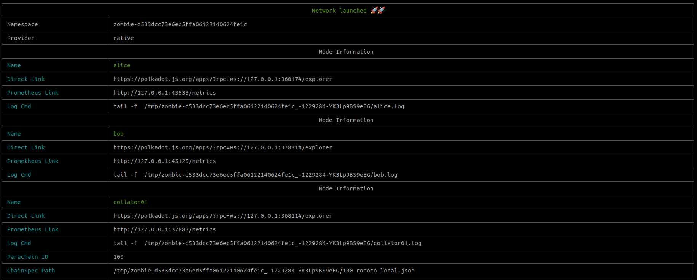
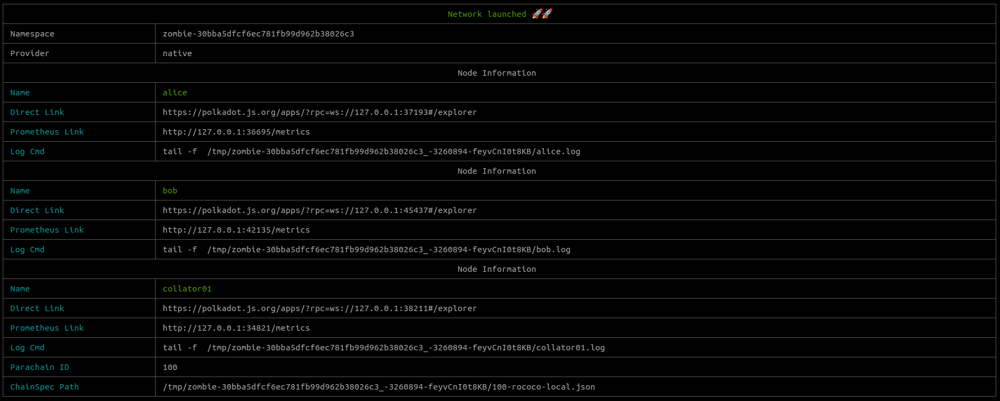

# Zombienet guide

## Intro

Zombienet was designed to be a flexible and easy to use tool, allowing users to describe complex network configurations that work across supported `providers` (e.g k8s, podman, native) and write tests in an intuitive way. The end goal is to create a smooth experience for parachain developers, giving them the confidence and simplicity to build and ship.

In this guide we will go through simple use cases as well as more complex ones, describing the trade-offs made and the _current_ constraints for both network configurations and test specifications.

### Example 1 - Small network (2 validators/ 1 parachain)

In this example [small-network](https://github.com/paritytech/zombienet/blob/main/examples/0001-small-network.toml), we define a network (`rococo-local`) with two validators (alice/bob) and a parachain (paraId 100). Both of the validators are using the _default_ image, command and args.

```toml
[relaychain]
default_image = "docker.io/paritypr/polkadot-debug:master"
default_command = "polkadot"
default_args = [ "-lparachain=debug" ]
chain = "rococo-local"

  [[relaychain.nodes]]
  name = "alice"
  validator = true

  [[relaychain.nodes]]
  name = "bob"
  validator = true

[[parachains]]
id = 100

  [parachains.collator]
  name = "collator01"
  image = "docker.io/paritypr/colander:master"
  command = "adder-collator"
```

Using kubernetes as provider we can simply spawn this network by running:

```bash
./zombienet-linux -p kubernetes spawn examples/0001-small-network.toml
```

You will see how `zombienet` starts creating the needed resources to launch the network.
At the end of the process a list of `nodes` (with direct access links) will be printed. So, you can now connect to one of the `nodes`.




---

Now we've explored how to launch a network, let's add a test file to ensure that it works as expected.
In Zombienet the tests are defined in the `*.zndsl` file, which uses a _simple_ [DSL](./cli/test-dsl-definition-spec.md) to write test assertions.

[0001-small-network.zndsl](https://github.com/paritytech/zombienet/blob/main/examples/0001-small-network.zndsl)

```
Description: Small Network test
Network: ./0001-small-network.toml
Creds: config


# well known functions
alice: is up
bob: is up
alice: parachain 100 is registered within 225 seconds

# metrics
alice: reports node_roles is 4
alice: reports sub_libp2p_is_major_syncing is 0

# histogram
alice: reports histogram polkadot_pvf_execution_time has at least 2 samples in buckets ["0.1", "0.25", "0.5", "+Inf"] within 100 seconds

# logs
bob: log line matches glob "*rted #1*" within 10 seconds
bob: log line matches "Imported #[0-9]+" within 10 seconds

# system events
bob: system event contains "A candidate was included" within 20 seconds
alice: system event matches glob "*was backed*" within 10 seconds
```

Now, run the tests with the following command to get both the _launching_ output and the test reports:

```bash
./zombienet-linux -p kubernetes test examples/0001-small-network.zndsl
```


### Example 2 - Small network with replacements

In Example 1, we used some _hardcoded_ default values but sometimes it's more useful to be able to change them dynamically.
For example, if you are building images in your `CI` and those images have an unique tag. To address these cases, Zombienet uses a templating language called [Nunjucks](https://mozilla.github.io/nunjucks/) that allows defining environment variables which then can get updated at _runtime_.

Following the previous example, we will replace the _images_ with variables that will read the value from the environment:

[0002-small-network-env-vars.toml](https://github.com/paritytech/zombienet/blob/main/examples/0002-small-network-env-vars.toml)

```toml
[relaychain]
default_image = "{{ZOMBIENET_INTEGRATION_TEST_IMAGE}}"
default_command = "polkadot"
default_args = [ "-lparachain=debug" ]
chain = "rococo-local"

  [[relaychain.nodes]]
  name = "alice"
  validator = true

  [[relaychain.nodes]]
  name = "bob"
  validator = true

[[parachains]]
id = 100

  [parachains.collator]
  name = "collator01"
  image = "{{ZOMBIENET_COL_IMAGE}}"
  command = "adder-collator"
```

To spawn this network now we need to define the `ZOMBIENET_INTEGRATION_TEST_IMAGE` and `ZOMBIENET_COL_IMAGE` environment variables.
For example:

```bash
export ZOMBIENET_INTEGRATION_TEST_IMAGE=docker.io/paritypr/polkadot-debug:master
export ZOMBIENET_COL_IMAGE=docker.io/paritypr/colander:master
```

Now we can run this command to spawn the network:

```bash
./zombienet-linux -p kubernetes spawn examples/0002-small-network-env-vars.toml
```

And again we get the network info with direct links:



### Example 3 - Small network with custom images per node

Continuing with our `small network` example, this time we will be _overriding_ some of the default methods to allow developers to use and test different configurations, such as different `images` or `arguments`.

As an example, this config will use different `images` and `dbs` between the nodes.

[small network custom](https://github.com/paritytech/zombienet/blob/main/examples/0003-small-network-custom.toml)

```toml
[relaychain]
default_image = "docker.io/paritypr/polkadot-debug:master"
default_command = "polkadot"
default_args = [ "-lparachain=debug" ]

chain = "rococo-local"

  [[relaychain.nodes]]
  name = "alice"
  validator = true

  [[relaychain.nodes]]
  name = "bob"
  image = "docker.io/paritypr/polkadot-debug:5236-0.9.18-c55660e9-be16bd72"
  validator = true
  args = ["--database=paritydb-experimental"]

[[parachains]]
id = 100

  [parachains.collator]
  name = "collator01"
  image = "docker.io/paritypr/colander:master"
  command = "adder-collator"
```

We start by launching our simulated network using `zombienet`:

```bash
./zombienet-linux -p kubernetes spawn examples/0003-small-network-custom.toml
```

And we get the _information_ about the network.


**But** if we scroll up the output we can see that `bob` is using the custom image and argument we set.


In general all the config fields that start with `default_*` can be overridden in the `nodes` or `collators` config.

### Example 4 - Small network with cumulus based collator

Until now we've been using the _parachain tests collators_ that are built from the `polkadot` repo. In this example we will set the config to use a `cumulus` based collator.

Continuing with the example we are using, we need to change the `image` and `command` of the collator, and also set the config key `cumulus_based` to true.

[small network cumulus](https://github.com/paritytech/zombienet/blob/main/examples/0004-small-network-cumulus.toml)

```toml
[relaychain]
default_image = "docker.io/paritypr/polkadot-debug:master"
default_command = "polkadot"
default_args = [ "-lparachain=debug" ]

chain = "rococo-local"

  [[relaychain.nodes]]
  name = "alice"
  validator = true

  [[relaychain.nodes]]
  name = "bob"
  image = "docker.io/paritypr/polkadot-debug:5236-0.9.18-c55660e9-be16bd72"
  validator = true
  args = ["--database=paritydb-experimental"]

[[parachains]]
id = 100
cumulus_based = true

  [parachains.collator]
  name = "collator01"
  image = "docker.io/parity/polkadot-parachain:latest"
  command = "polkadot-parachain"
```

And again, we just _launch_ the network using the following command:

```bash
./zombienet-linux -p kubernetes spawn examples/0004-small-network-cumulus.toml
```

And get the network information but this time using a `cumulus based` collator.


### Example 5 - Big networks with groups

Sometimes you need to launch and test bigger networks and defining nodes one by one is a very _manual_ and error prone task. For this use cases Zombienet allows to define `groups` of nodes, for both `validators` and `collators`.

Using the `small network` example as base, we can add `groups` to spawn a bigger network.

```toml
[relaychain]
default_image = "docker.io/paritypr/polkadot-debug:master"
default_command = "polkadot"
default_args = [ "-lparachain=debug" ]

chain = "rococo-local"

  [[relaychain.node_groups]]
  name = "a"
  args = [ "-lparachain=debug", "--database=paritydb-experimental" ]
  count = 5

  [[relaychain.node_groups]]
  name = "b"
  count = 5

[[parachains]]
id = 100

  [[parachains.collator_groups]]
    count = 2
    [parachains.collator_groups.collator]
    name = "collator"
    command = "adder-collator"
    image = "docker.io/paritypr/colander:master"
```

We use `node_groups` and `collator_groups` to define the groups we want to spawn, then Zombienet will spawn the desired `count` and will name the `nodes`/`collators` with the _index_ suffix (e.g `a-1`).
Again, the groups use the `default_*` fields if they are not overridden in the group definition.

This time for `spawning` the network we will use the _concurrency_ (`-c`) flag to spawn the nodes in batches and speed up the process.

```bash
./zombienet-linux -p kubernetes -c 5 spawn examples/0005-big-network.toml
```

And this time we get also a bigger output...


You can use the _group name_ in the testing definition to make the same assertion on all the `nodes`/`collators` of the group.
For example:

```
Description: Big Network test
Network: ./0005-big-network.toml
Creds: config


# well known functions using groups
a: is up
b: is up

# metrics
a: reports node_roles is 4
b: reports sub_libp2p_is_major_syncing is 0
```

And now we can run the test and get the report

```bash
./zombienet-linux -p kubernetes -c 5 test examples/0005-big-network.zndsl
```


---

## Logs and troubleshooting

### Node logs

Logs are always a great resource for troubleshooting.
Zombienet gives you an easy way to access a node's logs in all the supported providers.

#### Logs in Kubernetes

Using the `kubernetes` provider you have a couple of options to follow the logs.
The first is using the command that `zombienet` suggests in the output of the running nodes:

```
	a-0 running

		 You can follow the logs of the node by running this command:

			 kubectl logs -f a-0
```

If you have a [prometheus operator](https://prometheus-operator.dev/) installed in your cluster, Zombienet will create a `PodMonitor` to collect all the node's logs and make it available in your Grafana dashboard which you can also use.

#### Logs in Podman

When you use `podman` you can follow the logs of the pods with the command suggestion that `zombienet` gives you when it spawns each pod.

```
    alice running

        You can follow the logs of the node by running this command:

                podman logs -f alice_pod-alice
```

#### Logs in native

With the `native` provider you can follow the logs of the pods with the command suggestion that `zombienet` gives you when it spawn a new process.
For example:

```
    alice running

        You can follow the logs of the node by running this command:

                tail -f /var/folders/rz/1cyx7hfj31qgb98d8_cg7jwh0000gn/T/zombie-22eaa5159aca78ff41e0249c3931b472_-91504-Ea3rT0YgKH2Y/alice.log
```

#### Troubleshooting

Zombienet provides an easy way to follow the spawning process by enabling the debug logs using the `DEBUG` environment variable to manage the output.

```bash
DEBUG=zombie* ./zombienet-linux -p kubernetes -c 5 test examples/0005-big-network.zndsl
```

---

## Podman infra

`Zombienet` will automatically spawn some infrastructure _pods_ to give the users a monitoring stack when the `podman` provider is used.


The `grafana` pod is running under the default user configuration and has `prometheus` and `tempo` already configured as datasources.
